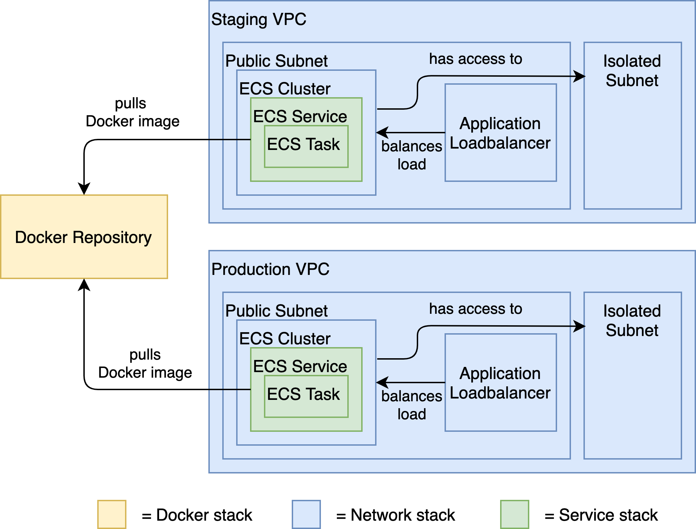

# Chapter 6

## Summary

In this chapter, we answer the following questions:
• How can we create reusable CDK constructs?
• How do we integrate such reusable constructs in our CDK apps?
• How can we design an easy-to-maintain CDK project?



The image above shows what we want to achieve. Each box is a CloudFormation resource (or a set of CloudFormation resources) that we want to deploy.

* *Docker Repository* stack - The underlying AWS service we’re using here is ECR - Elastic Container Registry.
* The *Network* stack - It deploys a VPC (Virtual Private Network) with a *public subnet* and an *isolated (private) subnet*. The public subnet now contains an Application Load Balancer (ALB) that forwards incoming traffic to an ECS (Elastic Container Service) Cluster - the runtime of our application. The isolated subnet is not accessible from the outside and is designed to secure internal resources such as our database.
* The *Service* stack - contains an *ECS service* and an *ECS task*. Remember that an ECS task is basically a Docker image with a few additional configurations, and an ECS service wraps one or several such tasks.

## Playing with the CDK Apps

```bash
npm install # to install the dependencies
```

Check the parameters inside the cdk.json (most importantly, set the account ID to your AWS account ID).

```bash
cd chapter-6/cdk
run repository:deploy 
run network:deploy 
run service:deploy
```

Then, have a look around in the AWS Console to see the resources those
commands created.

Don't forget to delete the stacks afterward:

```bash
run service:destroy
run network:destroy
run repository:destroy
```
